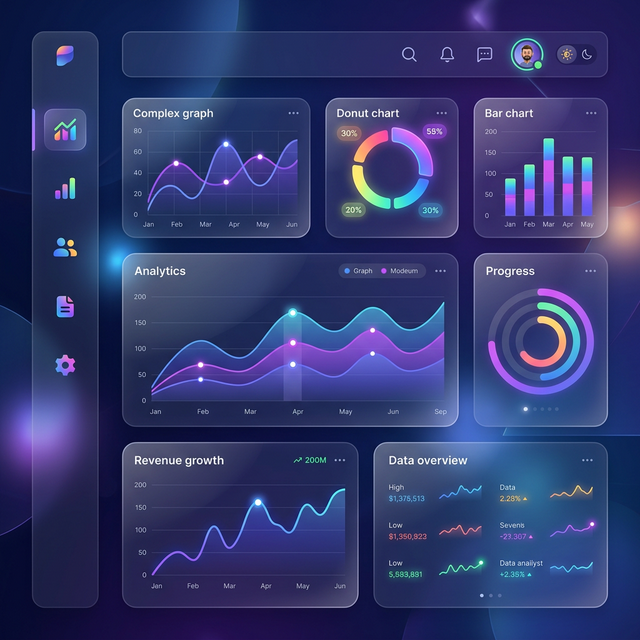

<div align="center">
  
  <h1>🏛️ UI-DEN Architecture</h1>
  <p><strong>A High-Performance, Aesthetic UI Foundation for Professional Dashboards.</strong></p>

  <p>
    
    
    
    
  </p>
  
  <br />
  
</div>

<br />

> [!NOTE]
> **UI-DEN** is a state-of-the-art architectural foundation for premium web applications. Built on **SolidJS**, **SolidStart**, and **Tailwind CSS v4.0**, it delivers extreme runtime performance with a curated, elite design aesthetic.

---

## 💎 Project Highlights

### ⚡ Hybrid Architecture (SSG + CSR)
UI-DEN utilizes a intelligent hybrid rendering strategy:
- **SSG (Static Site Generation)**: Public pages (`/`, `/docs`, `/help`) are pre-rendered into static HTML for instant loading and SEO dominance.
- **CSR (Client-Side Rendering)**: Interactive dashboards and authenticated routes function as a high-speed SPA for frictionless user transitions.

### 🎨 Design System: High-End Glassmorphism
Experience a professional, curated aesthetic out of the box:
- **Depth & Dimension**: Balanced layers with backdrop blurs and realistic drop-shadows.
- **Dynamic Themes**: 20 distinct accent palettes (Indigo, Rose, Emerald, etc.) and multiple background textures.
- **Micro-Animations**: Purposeful, 300ms transitions that make the interface feel alive.

### 🌓 Advanced Personalization
A global configuration engine allows users to tailor their experience in real-time:
- **View Modes**: Switch between **Wide** (maximized space) and **Centered** (focused layout).
- **Fullscreen Mode**: Native Browser Fullscreen integration (F11 equivalent) for immersive dashboards.
- **Theme Toggles**: Instant seamless Dark/Light mode switching.
- **Multi-Lingual**: Fully reactive i18n supporting 10+ languages (EN, MY, CN, KR, JP, RU, AR, TH, DE, GR).

---

## 🛠️ Modern Tech Stack

| Technology | Purpose |
| :--- | :--- |
| **SolidJS 1.9** | True fine-grained reactivity without a Virtual DOM. |
| **SolidStart 2.0** | The modern meta-framework for the Solid ecosystem. |
| **Tailwind 4.0** | Next-gen utility-first CSS for rapid, maintainable styling. |
| **Vitest** | Blazing fast unit testing with local storage and i18n coverage. |
| **Nitro 3.0** | The powerful server engine powering high-performance builds. |

---

## 📂 Architecture Overview

```text
📦 learn-solid-tailwind
 ┣ 📂 test/               # Comprehensive Unit & Integration Tests
 ┣ 📂 public/              # Static assets and pre-rendered content
 ┣ 📂 src/
 ┃ ┣ 📂 components/        # Reusable UI primitives and composites
 ┃ ┃ ┣ 📂 input/           # Controlled inputs (Button, Dropdown, Toggles)
 ┃ ┃ ┗ 📂 navigation/      # SideNav, TopNav, Mobile UX
 ┃ ┣ 📂 lib/               # Business logic, stores, and i18n
 ┃ ┣ 📂 routes/            # File-based routing (Protected vs Public)
 ┃ ┗ 📜 app.tsx            # Main application context and providers
 ┗ 📜 vite.config.ts       # Optimized SSG + CSR build configuration
```

---

## 🚦 Quality Assurance

UI-DEN is built with reliability in mind. Our testing suite verifies everything from core state logic to complex internationalization.

**Run Unit Tests:**
```bash
npm test
```

**E2E (Coming Soon):**
```bash
npx playwright test
```

---

## 🚀 Deployment & Development

### 🛠️ Prerequisites
- **Node.js**: `v22.0.0` or higher
- **NPM**: `v10.0.0` or higher

### 🏗️ Build & Optimization
```bash
# 1. Install dependencies
npm install

# 2. Start dev server (HMR enabled)
npm run dev

# 3. Build for production (Generates SSG static pages)
npm run build

# 4. Preview production build
npm run preview
```

---

## 🔐 Mock Credentials (Admin)
To explore the protected dashboard features:
- **User**: `admin`
- **Pass**: `admin`

---

<div align="center">
  <br />
  <p><i>Engineered with ❤️ for elite developers.</i></p>
</div>
