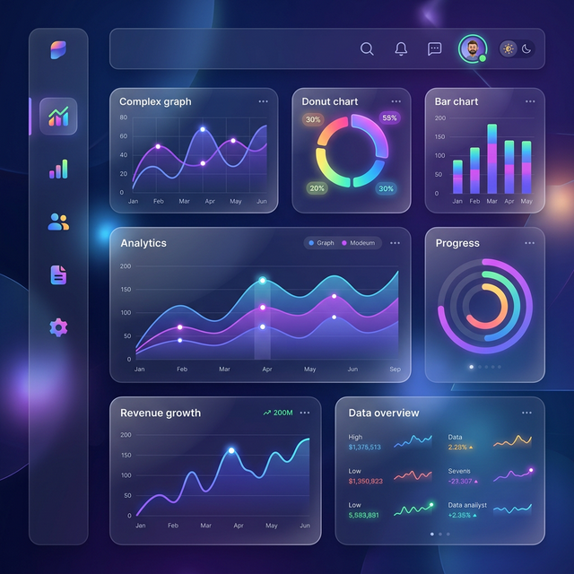

<div align="center">
  
  <h1>UI-DEN Architecture</h1>
  <p><strong>A High-Performance, Aesthetic UI Foundation for Professional Dashboards.</strong></p>

  <p>
    
    
    
    
  </p>
  
  <br />
  
</div>

<br />

> [!NOTE]
> **UI-DEN** is a state-of-the-art architectural foundation for premium web applications. Built on **SolidJS**, **SolidStart**, and **Tailwind CSS v4.0**, it delivers extreme runtime performance with a curated, elite design aesthetic.

---

## Project Highlights

### Hybrid Architecture (SSG + CSR)
UI-DEN utilizes a intelligent hybrid rendering strategy:
- **SSG (Static Site Generation)**: Public pages (`/`, `/docs`, `/help`) are pre-rendered into static HTML for instant loading and SEO dominance.
- **CSR (Client-Side Rendering)**: Interactive dashboards and authenticated routes function as a high-speed SPA for frictionless user transitions.

### Design System: High-End Glassmorphism
Experience a professional, curated aesthetic out of the box:
- **Depth & Dimension**: Balanced layers with backdrop blurs and realistic drop-shadows.
- **Dynamic Themes**: 20 distinct accent palettes (Indigo, Rose, Emerald, etc.) and multiple background textures.
- **Micro-Animations**: Purposeful, 300ms transitions that make the interface feel alive.

### Advanced Personalization
A global configuration engine allows users to tailor their experience in real-time:
- **View Modes**: Switch between **Wide** (maximized space) and **Centered** (focused layout).
- **Fullscreen Mode**: Native Browser Fullscreen integration (F11 equivalent) for immersive dashboards.
- **Theme Toggles**: Instant seamless Dark/Light mode switching.
- **Multi-Lingual**: Fully reactive i18n supporting 10+ languages (EN, MY, CN, KR, JP, RU, AR, TH, DE, GR).
- **Geographical Sync**: Deep URL state synchronization for map filters, allowing shareable/bookmarkable analytical views.
- **Searchable Controls**: Advanced dropdown filtering with wildcard support (`*`) and case-insensitive matching.

### Developer Experience: Interactive Documentation
UI-DEN prioritizes developer velocity with integrated documentation tools:
- **ComponentViewer**: A built-in utility for all sample pages that toggles between **Live Preview** and **JSX/HTML Source**.
- **Atomic Inputs**: A full suite of premium, controlled components:
  - `Button`: Multi-variant (Success, Error, etc.) with flexible icon layouts and 4-way tooltips.
  - `Slider`: Customizable ranges with discrete step support and animated tracks.
  - `ColorPicker`: Hex-based selection with visual feedback and integrated presets.
  - `FilePicker`: Drag-and-drop enabled with multiple file batch support.
  - `DatePicker`: Native-powered, theme-aware calendar selection.
  - `Radio`: Animated sliding selectors for binary or short-list choices.

---

## Workflow Designer System

A fully functional workflow designer/editor/runner/manager/viewer built with SolidJS.

### Features

**Canvas & Interaction**
- Infinite canvas with hardware-accelerated panning and smooth zoom (0.1x - 3x)
- Multi-select via Shift+Click or box selection
- Grid snapping (20px) for organized layouts
- Fit-to-screen and reset view controls

**Node System**
- 18 built-in node types across 5 categories:
  - **Triggers**: Webhook, Schedule, Manual
  - **Actions**: HTTP Request, Database, Email
  - **Logic**: IF, Switch, Merge, Loop
  - **Transform**: Code, Set, Filter
  - **Outputs**: Slack, Discord, Google Sheets, Webhook Response
- Dynamic input/output ports with multi-output support
- Node status indicators (idle, running, success, error, warning)
- Enable/disable nodes, add notes

**Connections**
- Bezier curve connections with animated data flow pulses
- Visual connection status (active/inactive)
- Draft connection preview while drawing

**Execution Engine**
- Real-time workflow execution with visual progress
- JavaScript code execution in Code nodes
- Conditional branching with IF/Switch nodes
- Data transformation pipeline
- Execution history and logging

**Workflow Management**
- Save/load workflows to localStorage
- Workflow list with search and tags
- Duplicate and delete workflows
- Undo/redo support (Ctrl+Z/Y)
- Read-only viewer mode

### Pages

| Route | Description |
|-------|-------------|
| `/workflow` | Workflow list with search, create, duplicate, delete |
| `/workflow/designer` | Full workflow editor with all controls |
| `/workflow/designer?id=xxx` | Edit existing workflow |
| `/workflow/viewer?id=xxx` | Read-only workflow viewing |

### Keyboard Shortcuts

| Shortcut | Action |
|----------|--------|
| `Ctrl+S` | Save workflow |
| `Ctrl+Z` | Undo |
| `Ctrl+Y` / `Ctrl+Shift+Z` | Redo |
| `Ctrl+A` | Select all nodes |
| `Ctrl+D` | Duplicate selected node |
| `Delete` / `Backspace` | Delete selected nodes |
| `Escape` | Clear selection / Cancel connection |
| `Ctrl+Scroll` | Zoom in/out |

### Component Architecture

```
src/
├── lib/workflow/
│   ├── types.ts          # Type definitions, node catalog, utilities
│   └── store.ts          # Reactive state management
├── components/workflow/
│   ├── WorkflowDesigner.tsx    # Main orchestrating component
│   ├── WorkflowCanvas.tsx      # Canvas with pan/zoom/selection
│   ├── WorkflowNode.tsx        # Node rendering
│   ├── ConnectionRenderer.tsx  # Bezier curve connections
│   ├── NodePalette.tsx         # Node library sidebar
│   ├── NodeProperties.tsx      # Node configuration panel
│   └── WorkflowToolbar.tsx     # Top toolbar
└── routes/protected/workflow/
    ├── index.tsx         # Workflow list page
    ├── designer.tsx      # Workflow editor
    └── viewer.tsx        # Read-only viewer
```

---

## Modern Tech Stack

| Technology | Purpose |
| :--- | :--- |
| **SolidJS 1.9** | True fine-grained reactivity without a Virtual DOM. |
| **SolidStart 2.0** | The modern meta-framework for the Solid ecosystem. |
| **Tailwind 4.0** | Next-gen utility-first CSS for rapid, maintainable styling. |
| **Vitest** | Blazing fast unit testing with coverage for geographical hierarchy and i18n. |
| **ECharts 6.0** | High-performance visualization engine for geographical and statistical data. |
| **Nitro 3.0** | The powerful server engine powering high-performance builds. |
| **Iconify** | Unified icon framework for 200,000+ vector icons. |

---

## Architecture Overview

```text
learn-solid-tailwind
 ┣ test/               # Comprehensive Unit & Integration Tests
 ┣ public/              # Static assets and pre-rendered content
 ┣ src/
 ┃ ┣ components/        # Reusable UI primitives and composites
 ┃ ┃ ┣ input/           # Controlled inputs (Button, Dropdown, Toggles)
 ┃ ┃ ┣ workflow/        # Workflow designer components
 ┃ ┃ ┣ content/         # Content components (WorkflowBoard, Charts)
 ┃ ┃ ┗ navigation/      # SideNav, TopNav, Mobile UX
 ┃ ┣ lib/               # Business logic, stores, and i18n
 ┃ ┃ ┗ workflow/        # Workflow types and state management
 ┃ ┣ routes/            # File-based routing (Protected vs Public)
 ┃ ┃ ┗ protected/workflow/  # Workflow pages
 ┃ ┗ app.tsx            # Main application context and providers
 ┗ vite.config.ts       # Optimized SSG + CSR build configuration
```

---

## Quality Assurance

UI-DEN is built with reliability in mind. Our testing suite verifies everything from core state logic to complex internationalization and geographical data integrity.

**Run All Tests:**
```bash
npm test
```

**Run Unit Tests only:**
```bash
npx vitest
```

---

## Deployment & Development

### Prerequisites
- **Node.js**: `v22.0.0` or higher
- **NPM**: `v10.0.0` or higher

### Build & Optimization
```bash
# 1. Install dependencies
npm install

# 2. Start dev server (HMR enabled)
npm run dev

# 3. Build for production (Generates SSG static pages)
npm run build

# 4. Preview production build
npm run preview
```

---

## Mock Credentials (Admin)
To explore the protected dashboard features:
- **User**: `admin`
- **Pass**: `admin`

---

<div align="center">
  <br />
  <p><i>Engineered with for elite developers.</i></p>
</div>
